allegro_opposition_primitives
=============================
This package implements a grasp controller for opposition primitives. A single opposition primitive represents a subset of grasping patches that are set up into 2 opposing groups for the purpose of applying oppositional pressure on a grasped object. A grasping patch denotes a contiguous surface of the hand acting in unison to exert a grasping force. For example frontal or side surface of a single phalange. A grasp can contain one or more opposition primitives.

This package provides a set of predefined grasps, with commands to open and close the hand according to the oppositional intention. Additionally, the sequeezing level along each axis of opposition can be independently or jointly specified.

It is straightforward to define new primitive-based grasps as required.

The package provides a gui interface and a topic-based interface to control the opening/closing of the hand and the squeeze level.

Dependencies
------------

This package depends on the [allegro-hand-ros][1] package. 

[1]: https://github.com/felixduvallet/allegro-hand-ros

Launch
------

The launch file [opposition_controller_with_hand.launch](launch/opposition_controller_with_hand.launch) can be used to launch both the opposition controller node and the underlying allegro pd-control node.

	roslaunch allegro_opposition_primitives opposition_controller_with_hand.launch HAND:=right NUM:=1

Alternatively, if you want the keyboard controls provided by the allegro-hand-ros package, you can start the nodes independently in different terminal windows:

	roslaunch allegro_opposition_primitives epfl_hand.launch HAND:=right NUM:=1 KEYBOARD:=true
	roslaunch allegro_opposition_primitives opposition_controller_alone.launch HAND:=right NUM:=1

Gui control
-----------
Run-time control of the chosen primitive is provided through the dynamic reconfigure GUI. After running the allegro_opposition_primitives node, run the dynamic reconfigure client. 

	rosrun rqt_reconfigure rqt_reconfigure 

You should be presented with the following GUI.
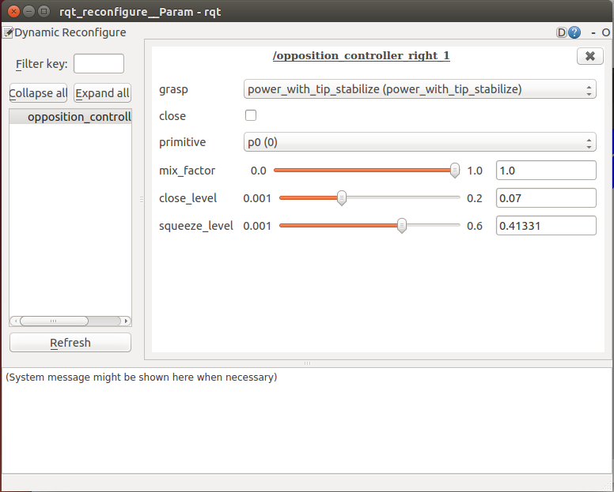

You can then:
- **chose grasp**
- **open / close** the hand
- **choose the active primitive:** Choosing a number greater than the number of oppositions comprising the grasp will choose all oppositions.
- **specify importance of a primitive** in the grasp.
- **influence speed of closing**
- **vary the squeeze level** 

Topic based control
--------------------
Grasp control is achieved by sending an `std_msgs::String` message on the topic `allegroHand/primitive_control_cmd`. Recognized strings are listed below.
- `grasp <grasp_name>` specifies the grasp to be controlled. Valid grasp names are defined in [primitive_grasp_definitions.yaml](parameters/primitive_grasp_definitions.yaml).
- `home` resets the hand to the default home position. 
- `open`, `close` opens and closes the hand according to the oppositional intentions defined in the grasp.
- `sq <num> <value>` prescribes a squeeze level `value` for the primitive `num`. If `num` is greater than the number of oppositions comprising the grasp, `value` is applied to all oppositions.

Predefined grasps
-----------------
The package predefines a set of grasps which can be selected for execution according to the task being performed. These are shown below.

Grasp name 			| primitive description						|	preshape 										| 		Closed 									|  
---------- 			| ---------------------						|   ------											|		------ 									|
Precision Pinch 	| ttOft12									| 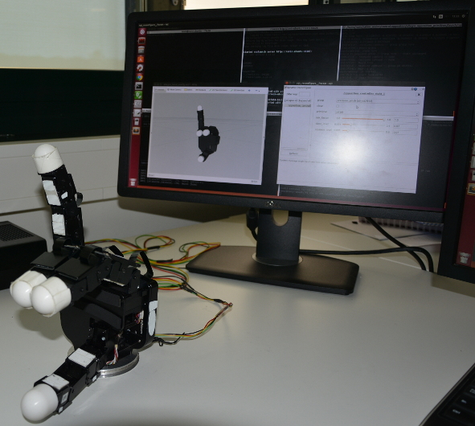		| 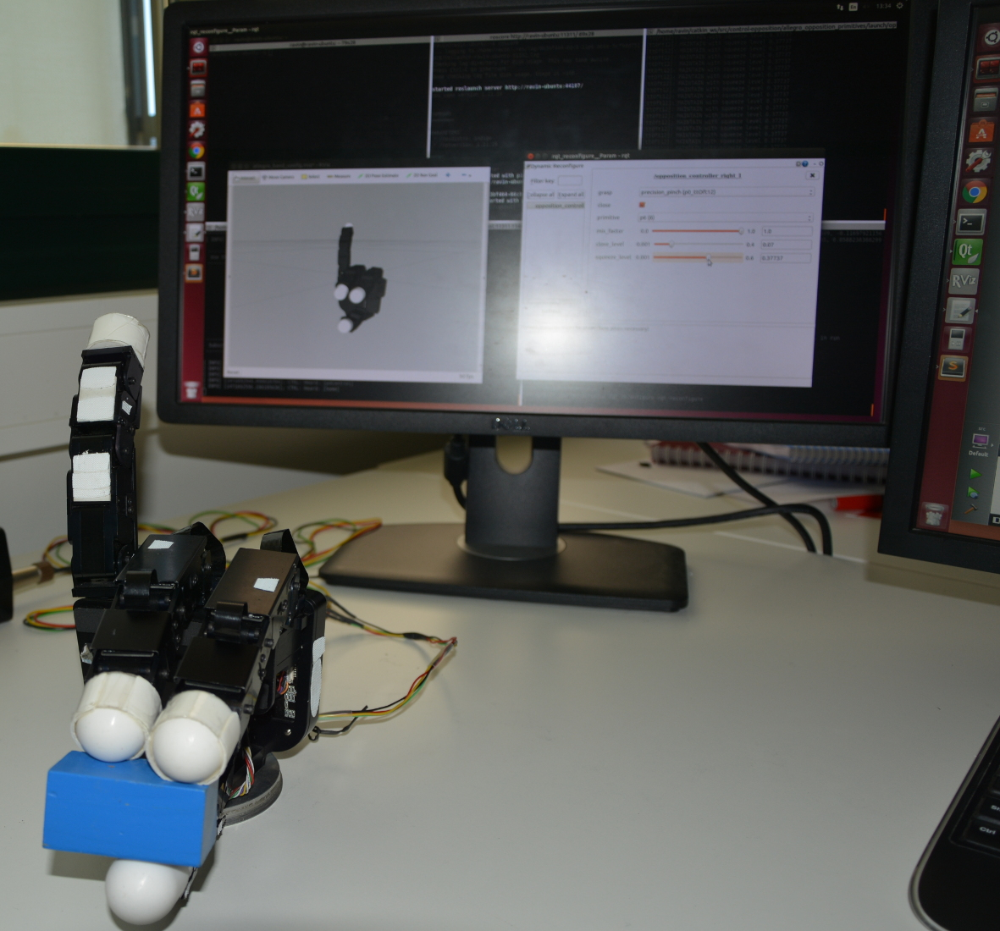    |
Writing Tripod	 	| ttOs2tip / ttOft1 / ft1Os2				| 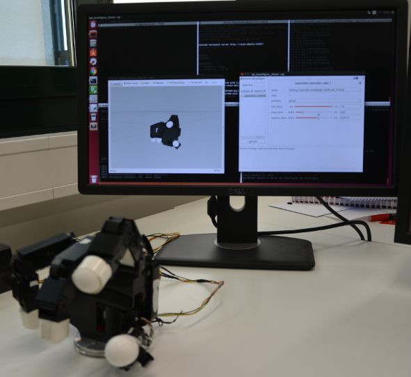		| 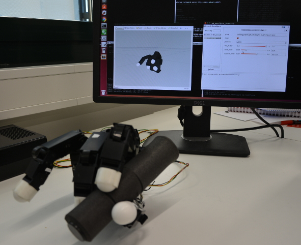		|
Precision Tap	 	| ttOs1/ ttOft2								| 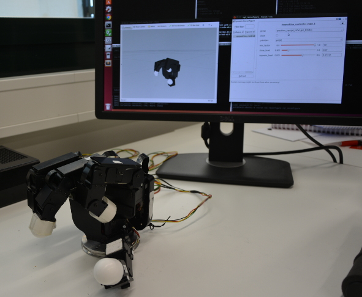		| 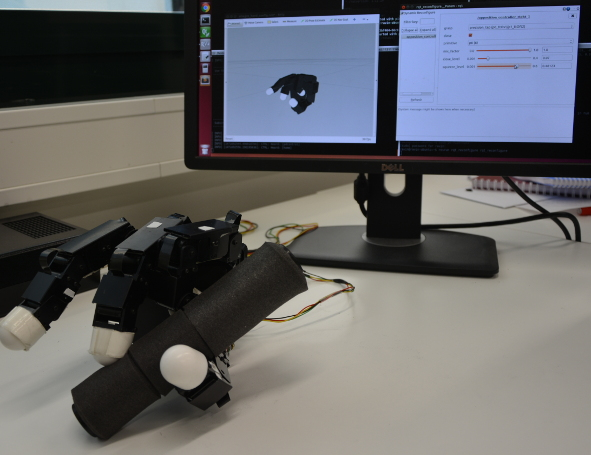		|
Book Grasp	 		| tsOfs123									| 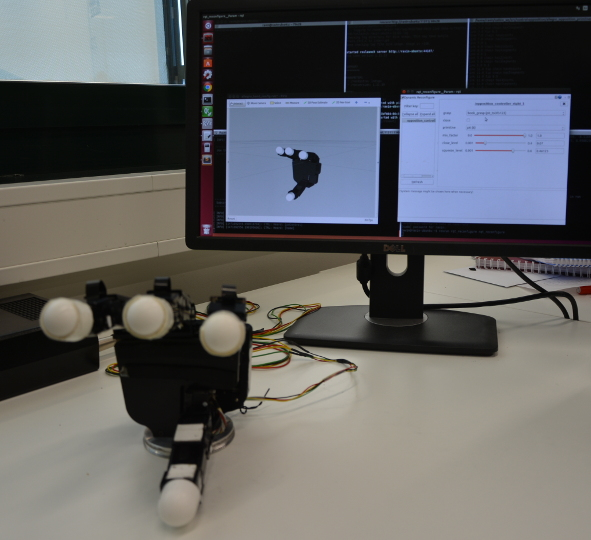			| 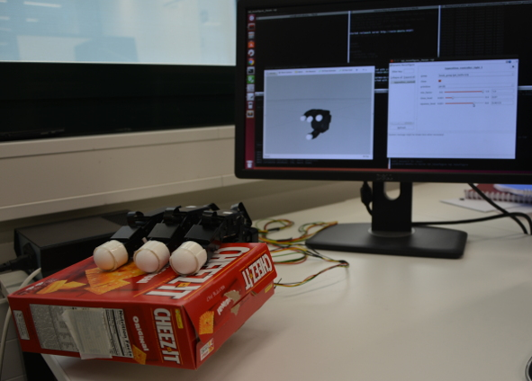			|
Cutting/Hammering	| pOfs23 / tsOs2 / ttOft1					| 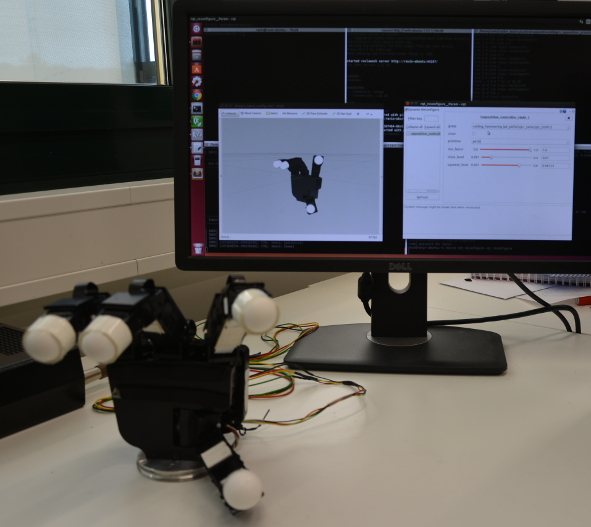	| 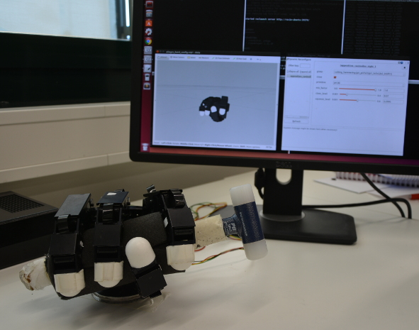	|
Jug Handle			| pOf23 / pOfs1 / tsOs1						| 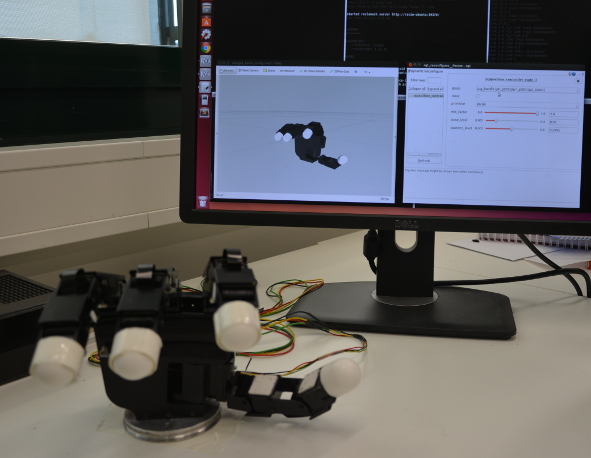			| 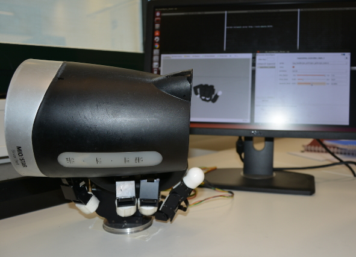			|
Pan Handle			| pOf23 / tsOs1								| 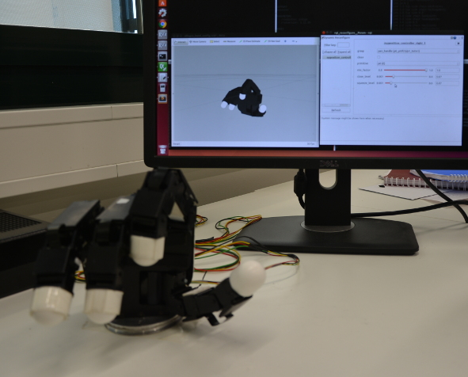			| 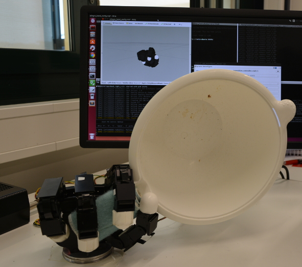  		|  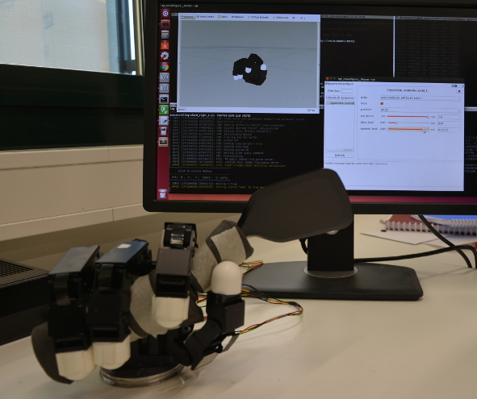

Defining new grasps
-------------------

New grasps are defined in [primitive_grasp_definitions.yaml](parameters/primitive_grasp_definitions.yaml). 

A `primitives` section at the begining of the file defines single-opposition primitives. For example, consider a primitive made up of thumb surface acting against frontal surfaces of fingers 1 and 2. Let this primitive be named `tsOfs12`. It is defined as follows.

		tsOfs12:
		vf0_patch:  ['thumb_tip', 'thumb_dist', 'thumb_mid']
		vf0_imp:    [0.5,          1.0,          1.0]
		vf0_focus:  1.0
		vf1_patch:  ['index_tip', 'index_dist', 'index_mid', 'index_prox', 'middle_tip', 'middle_dist', 'middle_mid', 'middle_prox']
		vf1_imp:    [0.5,         1.0,          1.0,          0.5,          0.5,          1.0,           1.0,          0.5]
		vf1_focus:  1.0

A primitive is made of up 2 virtual fingers `vf0`, `vf1`. Each virtual finger defines 
- **vfX_patch:** the grasping patches that cooperate in applying an opposing force.  A complete list of grasping patches can be found in [patchInfo.cpp](src/patchInfo.cpp).
- **vfX_imp:** hint on the distribution of force among the patches indicating where is the pressure focussed. Each patch is assigned a value between 0 and 1.
- **vfX_focus:** the threshold value for patches to be considered as the focus of pressure.

The `grasps` section follows the `primitives` section. It defines grasps as being composed from one or more cooperating primitives. For example, consider a grasp composed of frontal fingers 2 and 3 acting against the palm (primitive `pOfs23`) and thumb surface against side of finger 1. We may call this a `power_with_tip_stabilize` grasp. It is defined as follows.

		power_with_tip_stabilize:  
		primitives: ['p0', 'p1']
		p0: ['pOfs123', 0.4]
		p1: ['tsOs1', 0.6]
		preshape:   [-0.1899, 0.6539, 0.9680, 0.2804, -0.0304, 0.8662, 0.7655, 0.3115, 0.1869, 0.9993, 0.5279, 0.5170, 0.5868, 0.0578, 0.2973, 0.5017]

- **primitives:** the number of primitives making up the grasp using identifier `p0`, `p1`, `p2`, etc.
- **pX:** the primitive name associated with each identifier and the importance of this primitive in the grasp.
- **preshape:** the starting pose of the hand before closure. The hand can be put in the appropriate pose using the gravity compensation mode `'Z'` available with the `grasp` controller of the [allegro-hand-ros](https://github.com/felixduvallet/allegro-hand-ros) package. The `/allegroHand/joint_states` topic gives the preshape joint vector.

